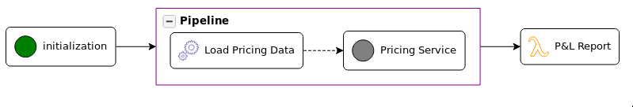

[](https://circleci.com/gh/xcomponent/koordinator-demo-pricing)

# Demo Pricing Scenario

This scenario illustrates the use of XComponent Scenario to implement a pricing workflow.



## Featuring

* Pipelines
* NodeJS Workers
* AWS Lamba functions
* Partial executions
* Automatic retries

## Requirements

* XC Scenario
* Amazoin AWS account
* Kubernetes cluster
* Terraform

## Usage

You can use terraform to deploy this scenario on your own XC Scenarios infrastructure.

``` shell
terraform apply
```

